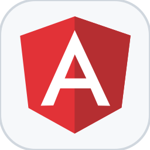
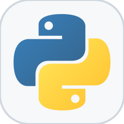
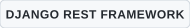
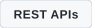
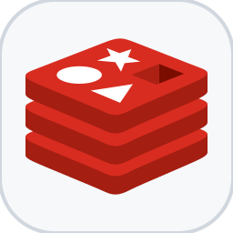

<picture>
  <source media="(max-width: 640px) and (prefers-color-scheme: dark)" srcset="./banner-mobile.svg" />
  <source media="(max-width: 640px) and (prefers-color-scheme: light)" srcset="./banner-mobile-light.svg" />
  <source media="(prefers-color-scheme: dark)" srcset="./banner-desktop.svg" />
  <source media="(prefers-color-scheme: light)" srcset="./banner-desktop-light.svg" />
  
</picture>

 

<h2>Tech Stack</h2>

<h3>Frontend</h3>

  
  
  
  
  
  <picture><source media="(prefers-color-scheme: dark)" srcset="./assets/icons/angular.svg" /><source media="(prefers-color-scheme: light)" srcset="./assets/icons/light/angular.svg" /></picture>

<h3>Backend</h3>

  <picture><source media="(prefers-color-scheme: dark)" srcset="./assets/icons/python.svg" /><source media="(prefers-color-scheme: light)" srcset="./assets/icons/light/python.svg" /></picture>
  

  <picture><source media="(prefers-color-scheme: dark)" srcset="./assets/badges/django-rest-framework.svg" /><source media="(prefers-color-scheme: light)" srcset="./assets/badges/light/django-rest-framework.svg" /></picture>
  <picture><source media="(prefers-color-scheme: dark)" srcset="./assets/badges/rest-apis.svg" /><source media="(prefers-color-scheme: light)" srcset="./assets/badges/light/rest-apis.svg" /></picture>

<h3>Data &amp; Services</h3>

  <picture><source media="(prefers-color-scheme: dark)" srcset="./assets/icons/postgresql.svg" /><source media="(prefers-color-scheme: light)" srcset="./assets/icons/light/postgresql.svg" /></picture>
  <picture><source media="(prefers-color-scheme: dark)" srcset="./assets/icons/redis.svg" /><source media="(prefers-color-scheme: light)" srcset="./assets/icons/light/redis.svg" /></picture>
  <picture><source media="(prefers-color-scheme: dark)" srcset="./assets/icons/firebase.svg" /><source media="(prefers-color-scheme: light)" srcset="./assets/icons/light/firebase.svg" /></picture>
  <picture><source media="(prefers-color-scheme: dark)" srcset="./assets/icons/supabase.svg" /><source media="(prefers-color-scheme: light)" srcset="./assets/icons/light/supabase.svg" /></picture>

<h3>DevOps &amp; Deployment</h3>

  
  <picture><source media="(prefers-color-scheme: dark)" srcset="./assets/icons/github-actions.svg" /><source media="(prefers-color-scheme: light)" srcset="./assets/icons/light/github-actions.svg" /></picture>
  <picture><source media="(prefers-color-scheme: dark)" srcset="./assets/icons/linux.svg" /><source media="(prefers-color-scheme: light)" srcset="./assets/icons/light/linux.svg" /></picture>

<h3>Tools</h3>

  
  <picture><source media="(prefers-color-scheme: dark)" srcset="./assets/icons/github.svg" /><source media="(prefers-color-scheme: light)" srcset="./assets/icons/light/github.svg" /></picture>
  
  <picture><source media="(prefers-color-scheme: dark)" srcset="./assets/icons/vscode.svg" /><source media="(prefers-color-scheme: light)" srcset="./assets/icons/light/vscode.svg" /></picture>

