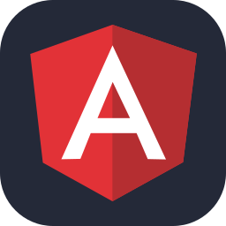
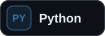
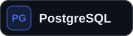
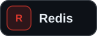
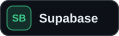
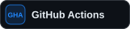
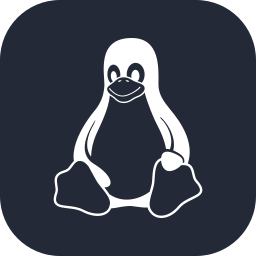
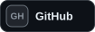
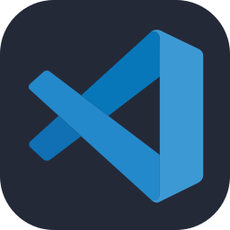

<picture>
  <source media="(max-width: 640px)" srcset="./banner-mobile.svg" />
  
</picture>

 

<h2>Tech Stack</h2>

<h3>Frontend</h3>

  
  
  
  
  
  

<h3>Backend</h3>

  
  

  
  

<h3>Data &amp; Services</h3>

  
  
  
  

<h3>DevOps &amp; Deployment</h3>

  
  
  

<h3>Tools</h3>

  
  
  
  

