<picture>
  <source media="(max-width: 640px) and (prefers-color-scheme: dark)" srcset="./banner-mobile.svg" />
  <source media="(max-width: 640px) and (prefers-color-scheme: light)" srcset="./banner-mobile-light.svg" />
  <source media="(prefers-color-scheme: dark)" srcset="./banner-desktop.svg" />
  <source media="(prefers-color-scheme: light)" srcset="./banner-desktop-light.svg" />
  
</picture>

 

<h2>About me</h2>

  I work as a Fullstack Developer across frontend and backend, turning ideas into complete applications.

  My projects include user interfaces, REST APIs, authentication, databases and testing.
  I also work with Docker, CI workflows and Linux-based deployments to bring applications beyond local development.

<h2>Tech Stack</h2>

<h3>Frontend</h3>

  
  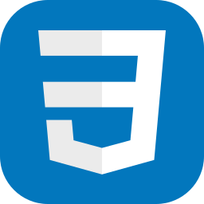
  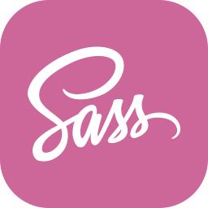
  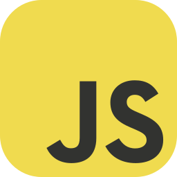
  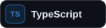
  <picture>
    <source media="(prefers-color-scheme: dark)" srcset="./assets/icons/angular.svg" />
    <source media="(prefers-color-scheme: light)" srcset="./assets/icons/light-png/angular.png" />
    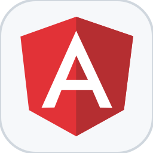
  </picture>

<h3>Backend</h3>

  <picture>
    <source media="(prefers-color-scheme: dark)" srcset="./assets/icons/python.svg" />
    <source media="(prefers-color-scheme: light)" srcset="./assets/icons/light-png/python.png" />
    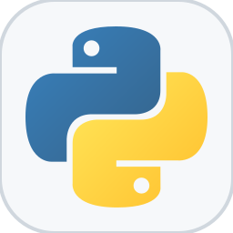
  </picture>
  

  <picture>
    <source media="(prefers-color-scheme: dark)" srcset="./assets/badges/django-rest-framework.svg" />
    <source media="(prefers-color-scheme: light)" srcset="./assets/badges/light-png/django-rest-framework.png" />
    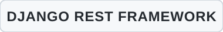
  </picture>
  <picture>
    <source media="(prefers-color-scheme: dark)" srcset="./assets/badges/rest-apis.svg" />
    <source media="(prefers-color-scheme: light)" srcset="./assets/badges/light-png/rest-apis.png" />
    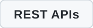
  </picture>

<h3>Data &amp; Services</h3>

  <picture>
    <source media="(prefers-color-scheme: dark)" srcset="./assets/icons/postgresql.svg" />
    <source media="(prefers-color-scheme: light)" srcset="./assets/icons/light-png/postgresql.png" />
    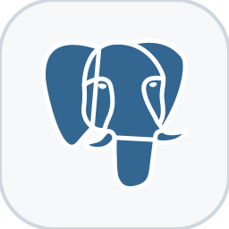
  </picture>
  <picture>
    <source media="(prefers-color-scheme: dark)" srcset="./assets/icons/redis.svg" />
    <source media="(prefers-color-scheme: light)" srcset="./assets/icons/light-png/redis.png" />
    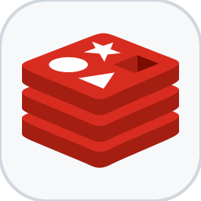
  </picture>
  <picture>
    <source media="(prefers-color-scheme: dark)" srcset="./assets/icons/firebase.svg" />
    <source media="(prefers-color-scheme: light)" srcset="./assets/icons/light-png/firebase.png" />
    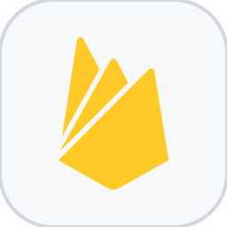
  </picture>
  <picture>
    <source media="(prefers-color-scheme: dark)" srcset="./assets/icons/supabase.svg" />
    <source media="(prefers-color-scheme: light)" srcset="./assets/icons/light-png/supabase.png" />
    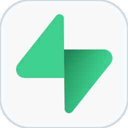
  </picture>

<h3>DevOps &amp; Deployment</h3>

  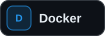
  <picture>
    <source media="(prefers-color-scheme: dark)" srcset="./assets/icons/github-actions.svg" />
    <source media="(prefers-color-scheme: light)" srcset="./assets/icons/light-png/github-actions.png" />
    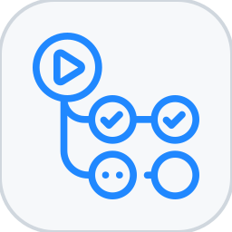
  </picture>
  <picture>
    <source media="(prefers-color-scheme: dark)" srcset="./assets/icons/linux.svg" />
    <source media="(prefers-color-scheme: light)" srcset="./assets/icons/light-png/linux.png" />
    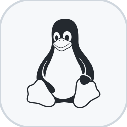
  </picture>

<h3>Tools</h3>

  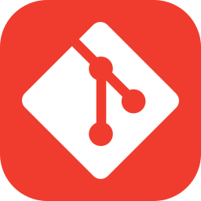
  <picture>
    <source media="(prefers-color-scheme: dark)" srcset="./assets/icons/github.svg" />
    <source media="(prefers-color-scheme: light)" srcset="./assets/icons/light-png/github.png" />
    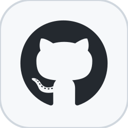
  </picture>
  
  <picture>
    <source media="(prefers-color-scheme: dark)" srcset="./assets/icons/vscode.svg" />
    <source media="(prefers-color-scheme: light)" srcset="./assets/icons/light-png/vscode.png" />
    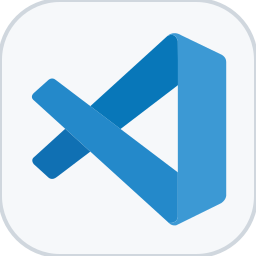
  </picture>

<h2>Selected Projects</h2>

<h3>&nbsp; Videoflix Backend</h3>

  Backend for a video streaming platform with authentication, asynchronous video processing, caching and authenticated HLS streaming.

  <strong>Django · Django REST Framework · PostgreSQL · Redis · Docker · FFmpeg</strong>

  <a href="https://ahmet-balci.de/projects/videoflix/">Live Demo</a>
  ·
  <a href="https://github.com/AhmetB-Dev/Videoflix-backend">Repository</a>

<h3>&nbsp; PollApp</h3>

  Responsive survey application built with Angular, featuring dynamic forms, reusable components and persistent data with Supabase.

  <strong>Angular · TypeScript · SCSS · Supabase · PostgreSQL</strong>

  <a href="https://ahmet-balci.de/projects/poll-app/">Live Demo</a>
  ·
  <a href="https://github.com/AhmetB-Dev/poll-app">Repository</a>

<h3>&nbsp; Coderr Backend</h3>

  REST API for a service marketplace with role-based access, offers, orders, reviews, filtering and permission-controlled workflows.

  <strong>Django · Django REST Framework · Token Authentication · django-filter</strong>

  <a href="https://ahmet-balci.de/projects/coderr/">Live Demo</a>
  ·
  <a href="https://github.com/AhmetB-Dev/Coderr-backend">Repository</a>

<h2>Portfolio</h2>

  Explore more projects, live demos and additional details on my
  <a href="https://ahmet-balci.de/">portfolio</a>.

