  

 

<h2>Tech Stack</h2>

<h3>Frontend</h3>

  

 

<h3>Services</h3>

  

  
  

 

<h3>Tools</h3>

  

 

<h2>Backend — Currently Learning</h2>

  

  Learning backend development with Node.js, Python, Django and REST APIs.

 

  Open to junior frontend and future fullstack development opportunities.

