<picture>
  <source
    media="(max-width: 640px)"
    srcset="./banner-mobile.svg"
  />
  
</picture>

 

<h2>Tech Stack</h2>

<h3>Frontend</h3>

  

  

<h3>Backend</h3>

  

  

<h3>Data & Services</h3>

  

<h3>Tools</h3>

  

